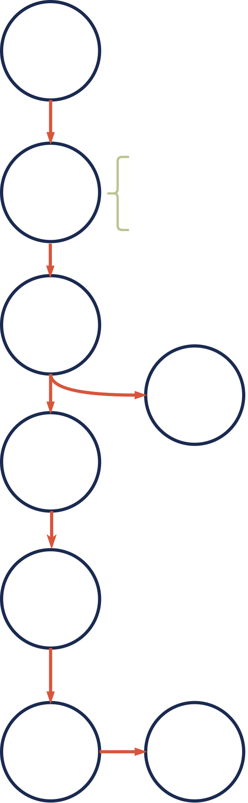

# 🌱 How to Contribute

### **SpiritDAO is an action-oriented community.**&#x20;

Decentralized Autonomous Organizations (DAOs) thrive on member creativity and contribution. The leader is often the person who knows what to do next.&#x20;

SpiritDAO provides the infrastructure, resources, and education necessary to help you contribute towards our shared purposes in the directions of your choosing.

Members leverage our [<mark style="color:yellow;">Collaboration Hub</mark>](https://app.charmverse.io/join?domain=spiritdao) to share ideas, collaborate around implementation, and make formal proposals.

Proposals allow requests for funding, set firm milestones for completion, and are voted on by SpiritDAO members for approval or rejection.  Proposal templates are pre-populated in our collaboration hub, making becoming involved easier and more convenient.&#x20;

**This process is explored in detail within our Member Onboarding!**

For more detailed information about the organization of Pods, Proposals, and more, see [<mark style="color:yellow;">SpiritDAO Governance.</mark>](../spiritdao-governance.md)

Proposal Process (Image) 

Voting  Process (Image)

