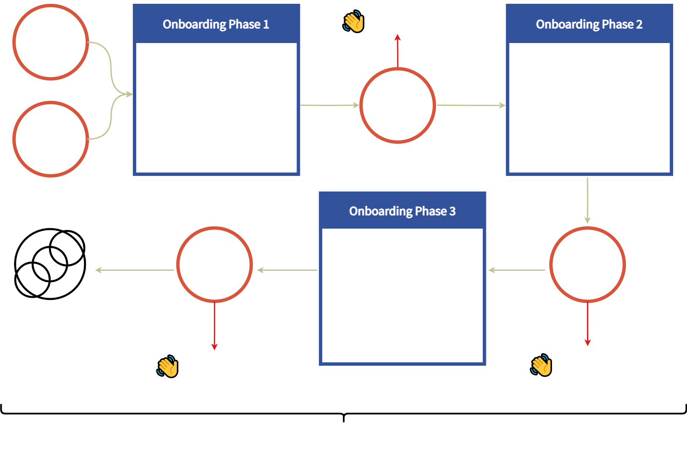

# 👐 Member Onboarding

SpiritDAO member onboarding occurs in small cohorts and combines self-guided learning and group discussions.

The onboarding contains both required and optional components. It takes about three and a half hours to complete all the necessary aspects of the process, four and a half including the optional content.

**Voting within the DAO is reserved for those who dedicate the focus and energy necessary to complete our onboarding process**. Token-holding members are not required to participate in the onboarding process.

For more details about our onboarding process, [<mark style="color:yellow;">visit our collaboration hub</mark>](https://app.charmverse.io/spiritdao/page-7514451482475966)<mark style="color:yellow;">.</mark>&#x20;

<figure><figcaption></figcaption></figure>
