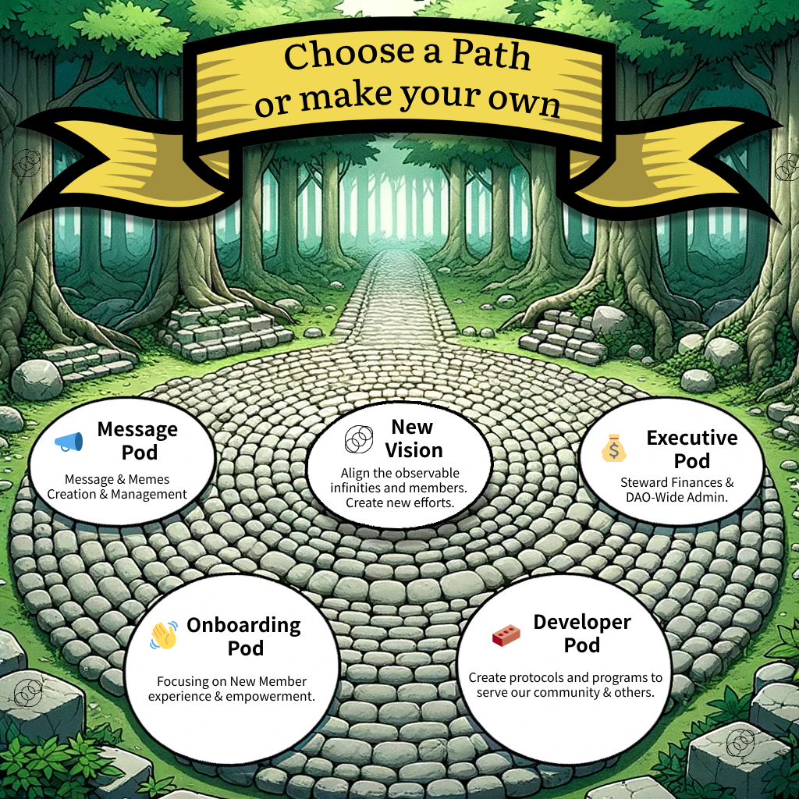

# 🦸 Membership Details

**Note: As of 11/5/24 Membership is Invite-only - we are rethinking our approach during this period.**

SpiritDAO leverages time-limited, non-transferable digital tokens to verify membership, identity, contribution, and benefits such as members' access to virtual and physical resources.&#x20;

Tokens are issued in batches (rounds) with gaps between new member onboarding to ensure organic growth. We strictly enforce a single membership token per individual.

We offer pathways for membership that do and do not require donations.&#x20;

Donation tiers are <mark style="color:purple;">**means based**</mark> and higher tiers provide minor (not-voting) perks.

We accept dollars, specific cryptocurrencies, and $SELF tokens as donations in exchange for membership access. Donations may also be made outside membership tokens for those with the resources.

Upon formalization of our 501c3, your donations will be charitable write-offs.\

Membership Tiers

Each membership tier represents unique access and agency within the SpiritDAO ecosystem. **100%** of all membership sales support the SpiritDAO community treasury.

You can donate to receive a membership at [<mark style="color:yellow;">https://join.spiritdao.org.</mark> ](https://join.spiritdao.org)

### Tier 4 - Advocate

* Four (4) Month Membership
* Members-only Community Access
* Members-only Content & Resources
* Collaboration Hub Access
* Unique Artifact Access
* 0.01 Eth / $20 USD

### Tier 3 - Embrace

* One (1) Year Membership
* Advocate Benefits +
* Collaboration Hub Agency / Bounty Participation
* 0.111 Eth / $200 USD

### Tier 2 - Become

* One (1) Year Membership
* Embrace Benefits +
* Priority Events Access
* 1.11 Eth / $2000 USD

### Tier 1 - Catalyze

* One (1) Year Membership
* Become Benefits +
* Priority Event Input
* 4.2 Eth / $7500 USD

🚨 Membership donations are _non-refundable._

No-Cost Membership Opportunities

SpiritDAO is an inclusive community. We recognize that every individual has inherited a unique set of circumstances, and that want to ensure pathways to access outside of capital.&#x20;

## Proof of Curiosity

This free membership tier provides users 30 days to complete SpiritDAO's [<mark style="color:yellow;">Onboarding Process</mark>](https://app.charmverse.io/spiritdao/page-7514451482475966)<mark style="color:yellow;">.</mark>&#x20;

Upon successful completion of onboarding, PoC members will be airdropped a one-time no cost [<mark style="color:yellow;">**Advocate**</mark>](membership-details.md#membership-tiers) membership token. All standard benefits, restrictions, and length of membership token will apply.&#x20;

All membership tokens are available for purchase with [<mark style="color:yellow;">$SELF</mark>](usdself-tokens.md), so members have the capacity to perpetually earn no-cost membership through their contributions to SpiritDAO.

Membership Pathways

SpiritDAO membership contains two potential pathways for members to explore depending on their desired level of engagement.

<mark style="color:green;">**Supporting Members**</mark> represent all token-holding members of the SpiritDAO community. Supporting members possess a wide range of access and agency within the DAO and serve to further our shared efforts in a variety of directions. Supporting members have not completed SpiritDAO's [<mark style="color:yellow;">onboarding process</mark>](https://app.charmverse.io/spiritdao/page-7514451482475966) and do not possess governance rights.

<mark style="color:green;">**Verified Members**</mark> are individuals who complete our [<mark style="color:yellow;">onboarding process</mark>](https://app.charmverse.io/spiritdao/page-7514451482475966)<mark style="color:yellow;">.</mark>  Voting and governance rights are reserved for our verified members. Governance at SpiritDAO is a privilege and responsibility. Verified Members must remain active in our community to retain their status. Formal onboarding support helps members understand the "why" and "how" behind our philosophy, practice, and purpose and adds a layer of Sybil resistance.&#x20;

SpiritDAO offers ample pathways for contribution irrespective of your choice to formally onboard or not.

Proactive Inclusivity

At SpiritDAO we embrace [<mark style="color:yellow;">core values</mark>](../vision-and-message/core-values.md) to align us with the [<mark style="color:yellow;">single truth</mark>](../vision-and-message/the-single-truth.md) and [<mark style="color:yellow;">relational universe</mark>](../vision-and-message/the-relational-universe.md). &#x20;

Our commitment to equity in our interpersonal and systemic relationships demands that we include the voices of those who would otherwise have no access to us, prioritizing the presently disenfranchised. A portion (TBD) of each membership round will be set aside to support outreach and community building.

