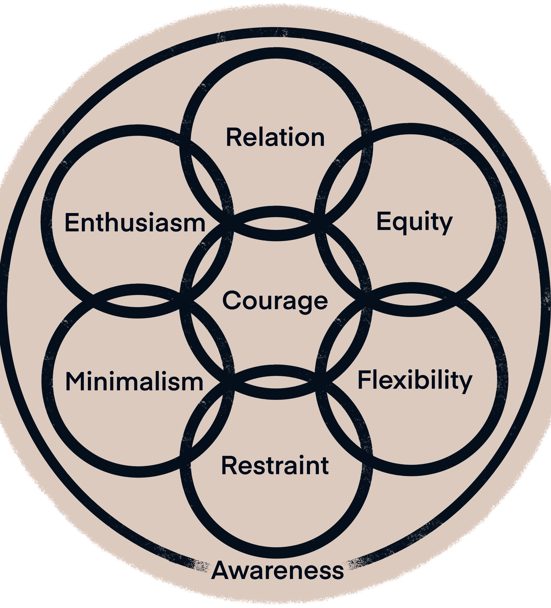

# 🌊 Core Values


An easy method for recalling the core values guiding our practice is to use the anagram "REFRAME Courage"


### RELATION

* Summary: The belief and practice of applying our knowledge of the relational universe to our interactions with others.
* Application: Ground your spirituality in the universal interconnectivity and alignment of the observable infinities.

### EQUITY

* Summary: The belief and practice of fairness in our personal and systemic relationships.
* Application: Question if your interactions with others are rooted in fairness and mutual divinity.

### FLEXIBILITY

* Summary: The belief and practice of embracing the moment without expectation.
* Application: Focus on actions, not outcomes. Embrace our lack of control over the greater circumstance and recognize that no moment reflects your expansive divinity.

### RESTRAINT

* Summary: The belief and practice of exercising disciplined choice.
* Application: Practice discipline with your habits and interactions with others.&#x20;

### AWARENESS

* Summary: The belief and practice of elevating our perception within and of the totality of experience.
* Application: Take time to observe the totality of your experience from a fresh perspective. What surrounds you, what direction are you heading, and how does it align with your vision?&#x20;

### MINIMALISM

* Summary: The belief and practice of eliminating the unnecessary.
* Application: Avoid acquiring the unnecessary. Ground happiness in the development of yourself and your networks.

### ENTHUSIASM

* Summary: The belief and practice of fully immersing oneself in undertakings.
* Application: Immerse yourself in whatever you do. Learn to love the journey of becoming more.

### COURAGE

* Summary: The belief and practice of fearlessness in the face of the unknown.
* Application: Decouple failure from emotion. Recognize that greatness occurs through choice within the moment.

<figure><figcaption>
A visual design of our core values highlighting their relationships.
</figcaption></figure>
