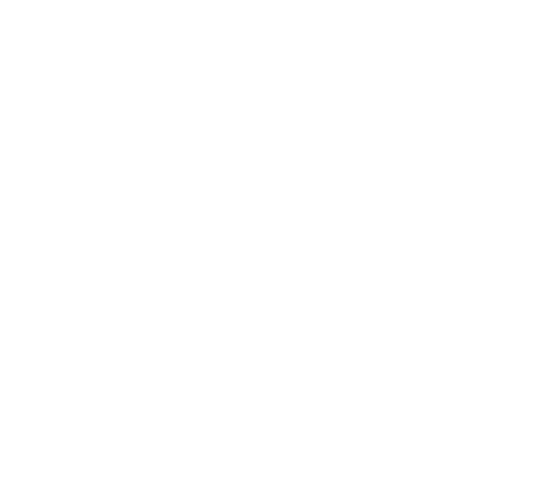

# 🏴 Symbology

<figure><figcaption></figcaption></figure>

**Our symbology represents the two** [<mark style="color:yellow;">**observable infinities.**</mark>](observable-infinities.md)

It consists of three overlapping circles.&#x20;

* The leftmost and center circle represent the embodied infinity of the individual.
* The rightmost and center circle represent the external infinity of the universe.
* The large outer circle represents the immediate present, the totality of the moment.

The alignment of the two observable infinities represents divinity in the moment. The experience of flowing alignment with the nature of being.

The extension of the two infinities beyond the totality of the moment represents how by aligning the observable infinities we become more than the totality of our circumstances.

\

\
